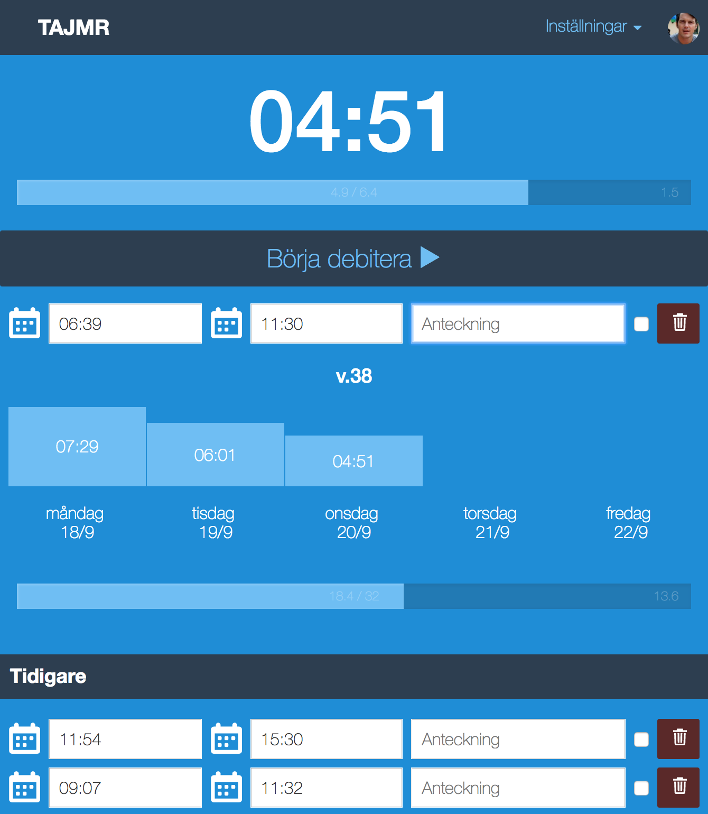

tajmr
=====
> Record time sometime [tajmr](https://hontas.github.io/tajmr/)

1. Press play to start recording time.
2. Then pause it.
3. Add a note if you want.
4. Get paid (tajmr won't help with this)



## dev
```shell
npm run dev
```

## deploy
- Gh-pages deployable like:
```shell
npm run deploy
```
