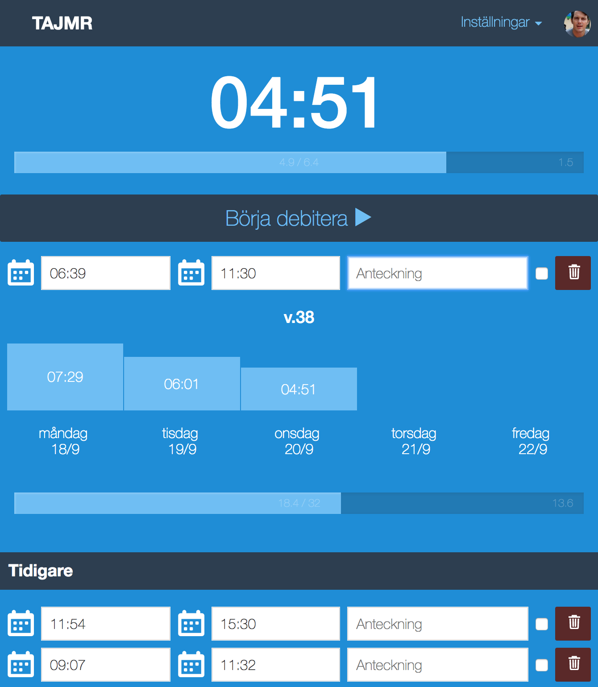

tajmr
=====
> Record time sometime [tajmr](https://hontas.github.io/tajmr/)

1. Press play to start recording time.
2. Then pause it.
3. Add a note if you want.
4. Get paid (tajmr won't help with this)



## dev
Use the Node version in `.nvmrc`.

```shell
npm ci
npm run dev
```

Run `npm run verify` before pushing: it runs what the PR check runs (lint, format check, knip, tests with
coverage, production build). See [AGENTS.md](AGENTS.md) for the project layout, conventions and workflow.

## environment
Local development and tests need no environment variables. The deploy build (`SENTRY_UPLOAD=true`) uploads
source maps to Sentry using `SENTRY_AUTH_TOKEN`, `SENTRY_ORG` and `SENTRY_PROJECT`, which the deploy workflow
injects at build time (it fails if one is missing, and removes the maps before publishing): `SENTRY_AUTH_TOKEN` is a secret on the `production` environment, `SENTRY_ORG` and
`SENTRY_PROJECT` are repository variables. `.env.example` only documents them. The Firebase web config is committed in
`client/js/utils/firebaseApi.js` (public by design).

## deploy
Deployed to GitHub Pages (source: GitHub Actions) by the **Build and Deploy** workflow. Run it manually
from the Actions tab; it only runs on `main`. The `build` job lints, tests and builds (in the
`production` environment, which holds `SENTRY_AUTH_TOKEN`), then the `deploy` job publishes the
artifact to the `github-pages` environment. Each deploy gets a calendar version (`YYYY.MM.DD`, then
`YYYY.MM.DD.2`, ...) that shows in the navbar, is the Sentry release, and is tagged `v<version>` after a
successful deploy.
